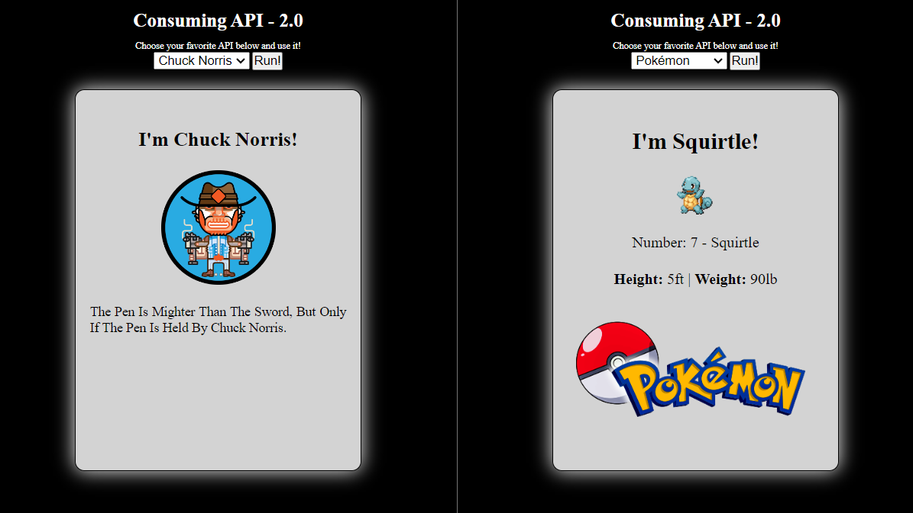

# Consuming API 2.0

  

## 📑 Description

Consuming API 2.0 was made to practice using more than one Application Programming Interface - API in the same project. In this case, Chuck Norris.io and PokéAPI were used.

⚠️ **Unlike the previous version, in this project the intention was to use the object-oriented programming paradigm.** ⚠️

  The APIs are available on the following websites:

Chuck Norris.io: https://api.chucknorris.io/
 
PokéAPI: https://pokeapi.co/

## 🔗 Functions

The main functionality of this project is the consumption of two Application Programming Interface - API alternately through the object-oriented programming paradigm, where a &#60;select&#62; element provides the alternation between Chuck Norris.io and PokéAPI.

## 💻 Language and Tools

For the development of this project, the following languages and tools were used:

- [HTML](https://developer.mozilla.org/pt-BR/docs/Web/HTML)
- [CSS](https://developer.mozilla.org/pt-BR/docs/Web/CSS)
- [JavaScript](https://developer.mozilla.org/pt-BR/docs/Web/JavaScript)
- [Chuckorris.io](https://api.chucknorris.io/)
- [PokéAPI](https://pokeapi.co/)

## 🚀 Deploy

Click on the link below to access the project 👇🏾

- [Consuming API 2.0](https://hrodrigomota.github.io/consuming-API-v2/)
